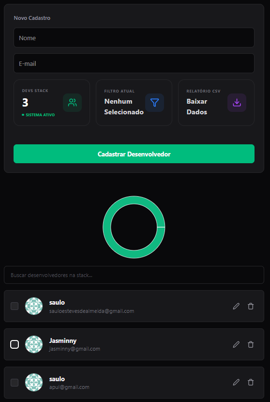

🚀 DevStack - Interactive Developer Dashboard
O DevStack é uma plataforma de alta fidelidade para gerenciamento de ecossistemas de desenvolvedores. O projeto foca em uma experiência de usuário (UX) fluida, utilizando animações de cascata, validação rigorosa de dados e visualização interativa através de gráficos dinâmicos.

📸 Preview

  

🛠️ Tecnologias de Elite (Stack 2026)
Frontend: React 19 + TypeScript.

Estilização: Tailwind CSS v4 (Design System focado em Modo Escuro).

Analytics: Recharts (Gráficos de rosca dinâmicos).

Animações: Framer Motion (Transições e Skeletons).

Feedback: React Toastify (Notificações em tempo real).

Infraestrutura: Vercel (Frontend) & Koyeb (Backend/API).

## 🧠 Engineering Challenges & Solutions

Developing this dashboard wasn't just about UI; it was about solving real frontend architecture problems:

- **State Syncing**: Managed complex filtering by syncing `Recharts` interaction with React state, allowing the PieChart to act as a dynamic filter for the user list.
- **Type Safety**: Integrated `Zod` for runtime validation, ensuring that the backend (Koyeb) only receives clean, structured data.
- **Perceived Performance**: Implemented `Framer Motion` stagger animations and `Skeleton Loaders` to eliminate layout shifts and provide a high-end user experience.
- **Efficient Data Handling**: Used `useMemo` to keep search and filtering logic performant, even with multiple criteria active at once.

✨ Funcionalidades Principais
📊 Dashboard Inteligente: Visualização segmentada por domínios de e-mail em tempo real.

🔍 Busca Instantânea: Filtro de busca otimizado com useMemo para performance máxima.

⚡ Experiência de Carregamento: Skeleton Loaders que eliminam o "pulo de layout" durante o fetch de dados.

🛡️ Gestão Segura (CRUD): Fluxo completo de cadastro, edição e exclusão com modal de confirmação.

📥 Exportação de Dados: Geração de relatórios em formato CSV com um clique.

🌓 Dark Mode Nativo: Interface otimizada para produtividade e conforto visual.

🚀 Como Rodar o Projeto
Clone o repositório:

Bash
git clone https://github.com/seu-usuario/devstack.git
Instale as dependências:

Bash
npm install
Inicie o ambiente de desenvolvimento:

Bash
npm run dev
Acesse no navegador: http://localhost:5173